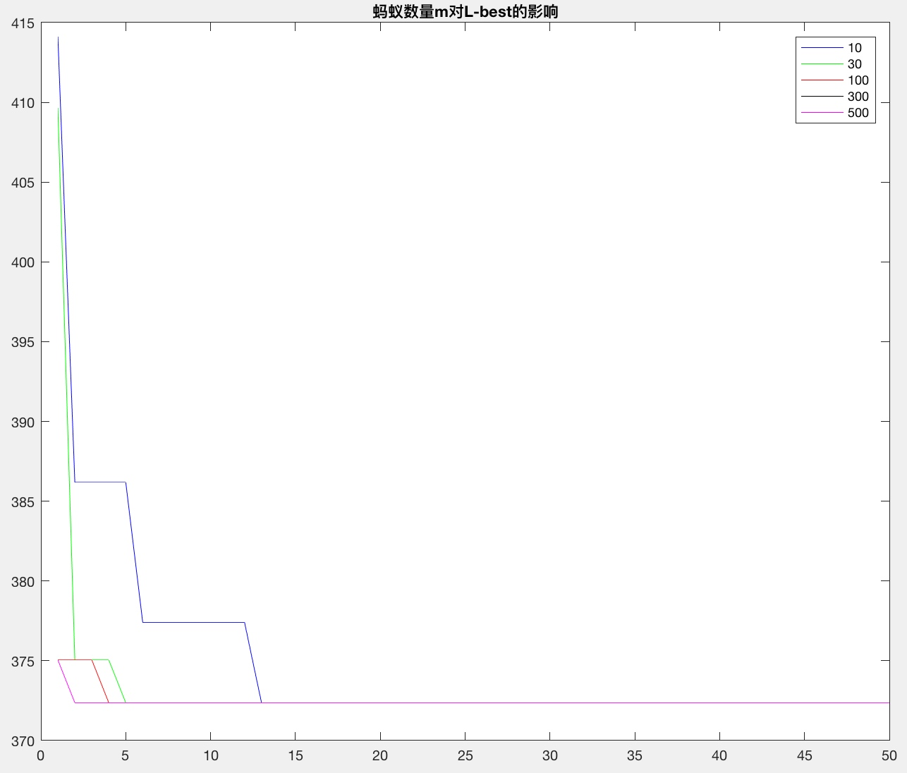
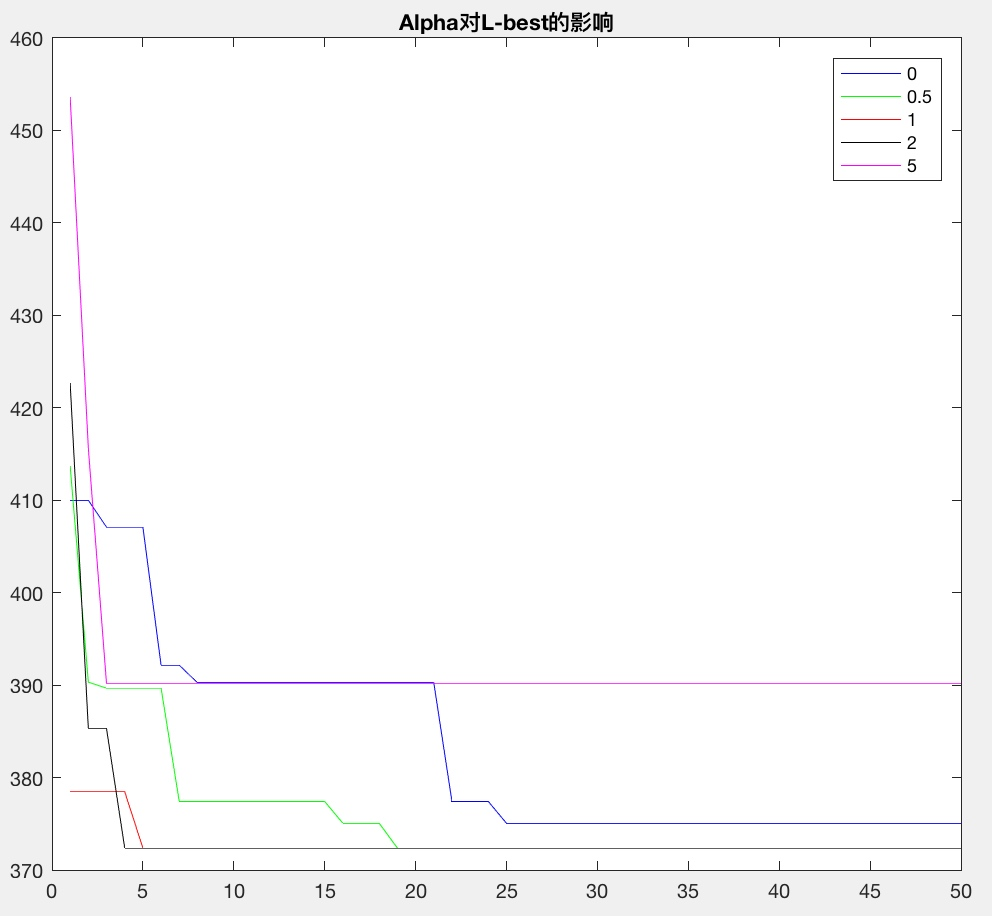
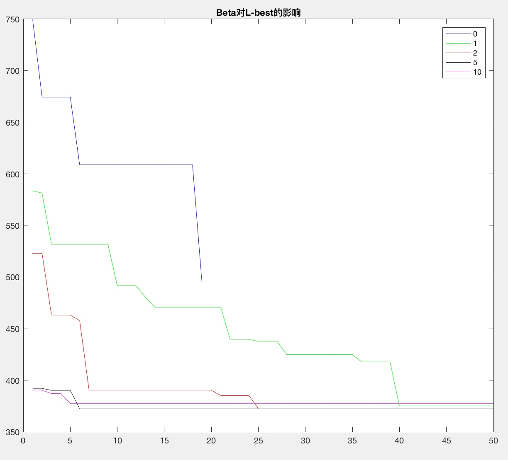

蚁群算法的作业，本来想用C++写的。研究了半天得出结论：

> 🙈
> MATLAB写这个确实好写。
> 
> 😌

<!---more--->

# 蚁群算法求解TSP

算法关键代码：

```Matlab
 while NC<=NC_max        %--- Start ---
        % 随机放置蚂蚁
        Tabu=initTabu(n,m);
        % 蚂蚁跑完一圈
        Tabu=selectNextCity(Tabu,Tau,R_best,n,m,Alpha,Beta,Eta,NC);
        % 寻找路径
        [L_best,R_best,L,R]=findBestPath(Tabu,L_best,R_best,D,n,m,NC);
        %=== End1Time ===
        NC=NC+1;
        % 更新Tau
        Tau=updateTau(Tabu,Tau,L,Q,n,m,Rho);
        % 重置Tabu
        Tabu=zeros(m,n); 
end                    %--- End ---
```

## 自定义参数下求解出的最优路径


# 参数影响

## 蚂蚁数m对性能的影响



> 从图上可以看出，蚂蚁数m越大算法收敛越快。
> 
> 蚂蚁数较少时，虽然开始几代没有找到最优解，但经过几次迭代还是收敛到了相同的结果。

## 信息素重要程度Alpha对性能的影响

Alpha分别取的是 [0,0.5,1,2,5]


> 从图上可以看出Alpha在1和2的时候性能最好。
> 当Alpha=0时，并没有得到最优解。此时是贪心算法。
> 当Alpha=5时，效果更差。信息素影响大导致算法过早收敛。
> 当Alpha=0.5时，需要经过较多的代数才能收敛。

## 启发因子重要程度Beta对性能的影响



> 如图所示，Beta=5时求得的最短路径最小同时收敛速度也最快。
> 
> Beta为1时需要经过较多的代数才能收敛。
> 
> Beta为2、3时效果一般。而且都不一定能收敛到最优解。
> 
> Beta为0时则结果较差。因为此时没有随机选择，容易陷入局部最优。

# 源码

[下载](http://oo1.win/Hw.zip)
