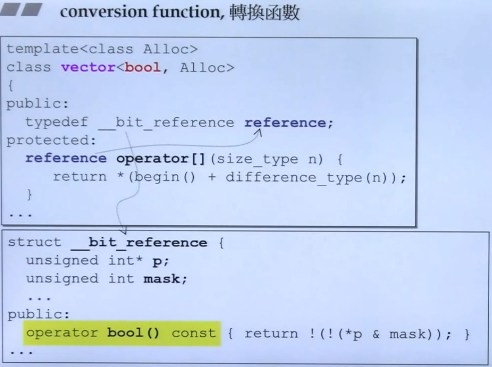
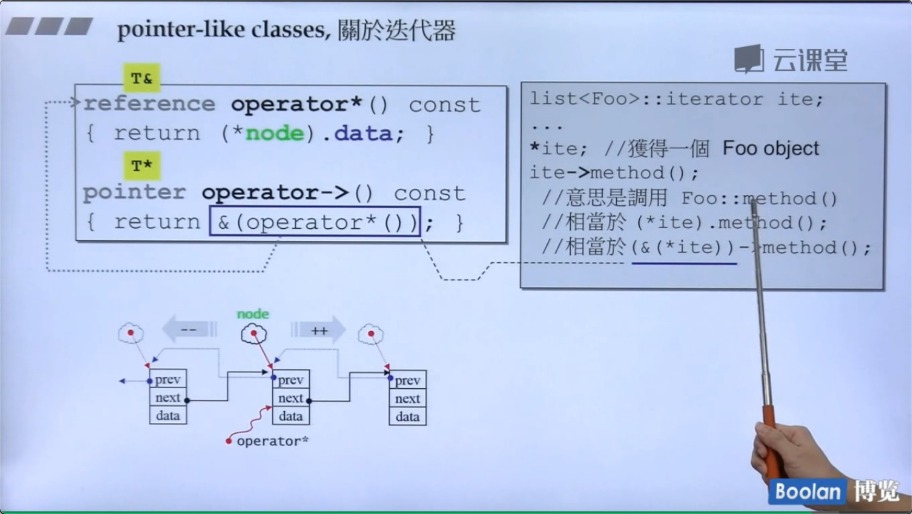

<!---more--->

# conversion function 转换函数

```cpp
class Fraction{
public:
    Fraction(int num,int den=1)
        : m_mumerator(num),m_denominator(den) { }
    operator double() const {
        return (double) (m_numerator/,_denominator);
    }
private:
    int m_numerator;
    int m_denominator;
}
```

`operator double()`注意： 1，不需要写返回类型（本来就是返回double，写了还可能写错） 2，加const（一定不会改数据，也不需要参数）

有了这个转换函数 就可以让 double和fraction 相加了。

```cpp
Fraction f(4);
double ans=f+4;
```

编译器发现。f可转double，于是转了相加。  

# non-explicit one argument constructor

```cpp
class Fraction{
public:
    Fraction(int num,int den=1)
        : m_mumerator(num),m_denominator(den) { }
    Fraction operator+(const Fraction & f) {
        return Fraction(...);
    }
private:
    int m_numerator;
    int m_denominator;
}
```

```cpp
Fraction f(3,5);
Fraction d = f+4;
```

由于没有转换函数。`f+4`里的f无法转换成double,而4会调构造函数（刚好只需要一个int参数就能构造），变成 `Fraction`类型。两个`Fraction`可以执行 + 操作。

但是，如果这时候再加上 上一节的 conversion 函数，

 f+4 .f可以变成double；4可以变成Fraction 。两条路都能走。编译器就不知道怎么相加了。

这时候怎么让编译器明确选哪条路呢？

## explicit

构造函数写成

```cpp
explicit Fraction(int num,int den=1)
    : m_mumerator(num),m_denominator(den) { }
```

 这个关键字告诉编译器。不要私自用这个构造函数。只有我主动用才能构造。

 标准库里用到的转换函数：



# pointer-like classes

**智能指针**看圆圈里的，`->`这个符号比较特殊。 返回的结果会一直调用下去。所以 重载后的` -> `解引用返回了 px后，自动又出现一个 `->`往下指向`method()`

**迭代器**



这里不太懂。

# function-like classes

重载了`()`的类。

标准库里有很多这种。干啥的呢？后面貌似会讲。

# namespace

```cpp
namespace jj01
{
    void func(){ ... }
}
jjo1::func();
```

# Template

`<class T>`里的`class`和`typename`用哪个都行

 类模板使用的时候要指明类型。

函数模板不需要。 因为编译器可以做“实参推导”，根据你传进的参数，推出要调用什么类型。

>  模板函数都是半编译。最开始的时候编译能过，但是传入参数后，能不能编译不一定了。
>

EX：`<T> bool isbigger(T a,T b){ return a>b}` 模板这么写没问题。但是传进来两个石头。class石头如果重载了 `>` 就能编译过。不然就不行了。

## member Template


在外层的T确定之后，里面的U也可以变化。

第9集。Mark。

# specialization 特化

关键字`template<>` 看下面的代码。如果Key传进来的是char\int\long 就会走这三段。 

## 偏特化

**个数上的偏**

泛化的T。如果可以为1个位的东西。特化一下，就可以省空间。

**范围上的偏**


就是泛化过的东西再泛化一次。这个东西就有两个泛化的版本。

注意区分这个和第一个完全的特化。

# template template parameter 模板模板参数


# 13 STL

这节课只是科普。不用看了。

# 14 三个主题

## variadic templates

一包参数

```cpp
void print(){//没有参数传进来时，结束
    
}
template<typename T,typename... Types>
void print(const T& firstArg,const Types&... args){
	cout<<firstArg<<endl;//取出第一个参数，打印
	print(args...);//递归地打印后面的一包参数
}
//用法：
print(7.5,"hello",bitset<16>(377),42);
//输出结果：
7.5
hello
00000000101111001
42
```

`sizeof...(args)`可以得到args里面有几个

## auto

这个我常用。pass

## ranged-base for

`for(auto a:vt){cout<<a;}`这种我常用，但是不能改里面的内容。于是有了这种写法：

`for(auto& a:vt){a+=1;}`取引用就OK了。

# 15 reference


其中的r是x的代表。所以sizeof(r)得到了8. 但其实这是一种假象！

-   [ ] `const`是不是函数签名的一部分？

    函数签名就是说区分两个函数是否相同。

    答案竟然是是。

    >   查到了：这是由于c++制定的规则，当const和non-const版本同时存在，const object只会调用const版本，non-const object只会调用non-const版本。

---

16是之前讲过的复习 继承&复合关系下的构造和析构顺序

# 17 vptr和vtbl

vptr：虚指针 指向虚函数

vtbl: 虚table（里面存了

静态绑定，编译器编译成：`call xxx地址`调用。

动态绑定，通过指针调用虚函数。通过指针vptr找到vtbl，再找到函数：

```cpp
(*(p->vptr)[n])(p);
//或
(*p->vptr[n])(p);
```

如果符合三要素编译器就会动态绑定：

-   是指针
-   指向子类
-   调用虚函数

# 18 关于this

所有的成员函数都有隐藏参数this

# 19 动态绑定

17~19讲的是一个东西

# 19.2 const

讲了刚刚我不懂搜到的这个知识点：当const和non-const版本同时存在，const object只会调用const版本，non-const object只会调用non-const版本。

non-const object可以调用const成员函数，反之则不行。

# 21 Operator new/delete 重载

new三个动作：1.执行operator new 分配内存 2.转型 3.执行ctor

delete 两个动作: 1.执行dtor 2.operator delete

重载`operator new,new[],delete,delete[]`，

```cpp
//可重载全局的::operator new
inline void* operator new(size_t size){
    return myAlloc(size);
}
inline void operator delete[](void* ptr){
    myFree(ptr);
}
void* myAlloc(size_t size){ return malloc(size);}
void myFree(void* ptr){retun free(ptr);}
//或在class中
class Foo{
public:
	void* operator new(size_t size);
    void operator delete(void*,size_t);//size_t是可选参数
}
```

# 22 example

说delete的重载不会被执行，仅仅用于抛出异常（在new时调用ctor失败会抛出）。

而且不写也行。说明你不在乎异常。

# 24 example

举了标准库string里重载new的例子：什么时候要重载呢？当你想无声无息不知不觉地多分配一些空间的时候。